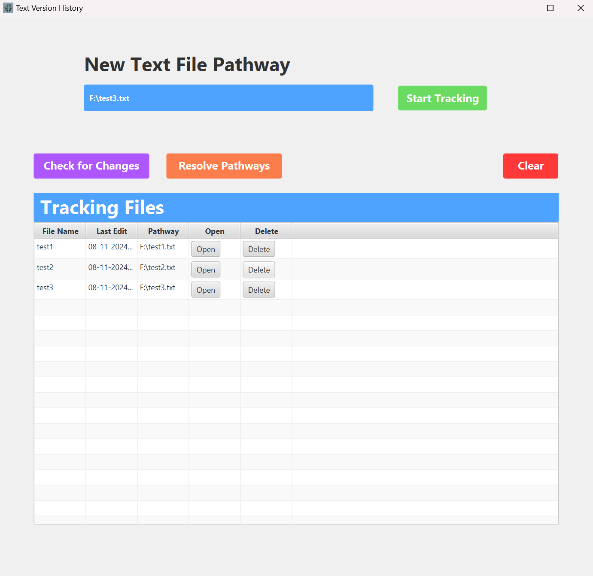
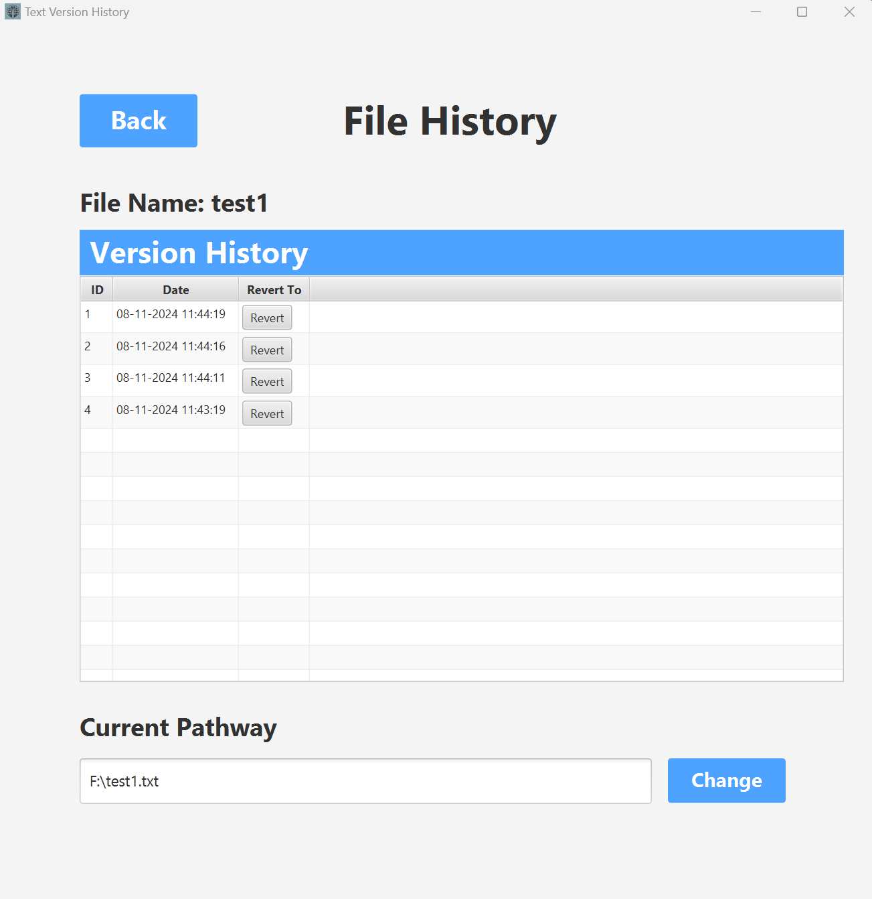

# TextVersionControl 
A simple application that uses JavaFX, JDBC, and JGit that allows users to save changes made to .txt files and revert back to previous versions. This could be useful for simple text editors for .txt files that don't have their own built in version history like notepad. Especially useful for backup codes that you may want saved to prevent them from being deleted or overwritten.

## Features
- **Version Control for .txt Files:** Easily save and revert changes made to .txt files.
- **Simple Interface:** User-friendly interface built with JavaFX, making it accessible for anyone to use.
- **Backup Protection:** Ideal for saving backup codes or important notes, ensuring they are never lost.

## Installation
1. Clone the repository: 
```
    git clone https://github.com/yourusername/TextVersionControl.git
```
2. Open the project in your preferred IDE.
3. Ensure you have JavaFX, JDBC, and JGit dependencies installed.
4. Convert project to executable
5. Run the application.

## Screenshots 



## Limitations 
- **File Type Restriction:** Only works for .txt files
- **No Diff View:** Currently can't view changes made to .txt files 
- **Manual Commits:** You have to manually click track changes button to make a commit to save the .txt file

## License 
This project is licensed under the MIT License. You are free to use, copy, modify, merge, publish, distribute, sublicense, and/or sell copies of the software, as long as you include the copyright notice.

